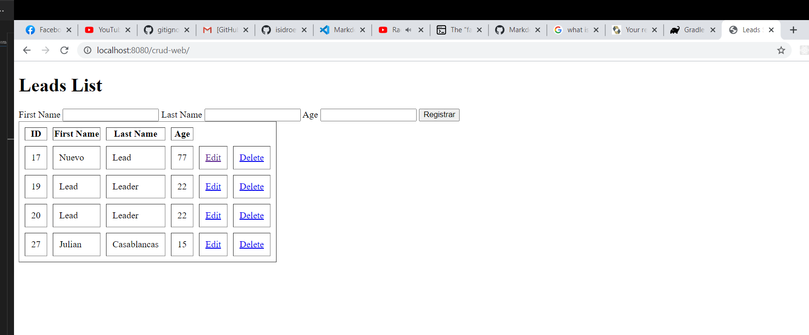
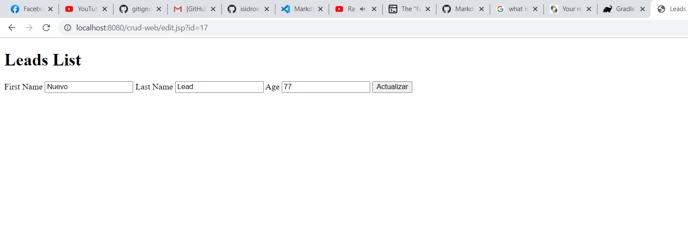

# CRUD usando java web con Hibernate y MySQL.

### Resumen
Aplicación de ejemplo CRUD hecha en java usando servlets.
Para la persistencia se utilizó  el framework [Hibernate](https://hibernate.org/orm/).
Como herramienta de compilación se utiliza [Gradle](https://gradle.org/).

### Descripción

Consiste en una entidad simple llamada Lead cuyos datos son: firstName, lastName y age. en una de las paginas jsp
se muestra el formulario para crear un nuevo Lead, y debajo de la misma aparece una tabla sencilla con los datos de los 
Lead registrados, dentro de la tabla aparecen dos enlaces por cada registro uno de ellos es para ir al formulario y editar
el registro en específico, y el otro es para borrar el registro en específico.





### Base de datos.

La base de datos consiste únicamente de una sola tabla con la siguiente estructura.

```sql
CREATE TABLE lead (
  id int primary key AUTO_INCREMENT,
  first_name varchar(255),
  last_name varchar(255),
  age int
);
```

### Correr la aplicación.

Para correr la aplicación necesitará tener cubiertos los siguientes puntos:

1. Tener gradle 6.6 o una versión compatible instalada.
2. Tener un servidor de MySQL, al que se tenga acceso para crear la base de datos correspondiente.
3. Una vez cuente con su servidor MySQL debe ajustar el archivo hibernate.cfg.xml con los datos de conexión que correspondan a su servidor.

Una vez tenga los anteriores puntos cubiertos proceda con los siguientes pasos.

#### Ejecutar la aplicación con gradle.
```
gradle appRun
```
En caso de estar utilizando un gradle wrapper.
```
gradlew appRun
```
Deberá eventualmente tener un resultado similar al siguiente en la terminal.


A partir de aquí se puede ingresar a la url que se indica en la consola.

### Puntos que se podrían mejorara de la aplicación.
1. Hacer uso de la Hibernate a través de la JPA para mejorar el manejo y configuración de las conexiones y entidades de la base de datos.

2. Guardar todos los datos sensibles (datos de conexión) en variables de entorno o similar.

3. Hacer un mejor manejo de las rutas en los servlets.

4. En general mejorar como estan concebidos los artefactos de la aplicación para que sea algo más estándar, con una mejor semántica.

5. Buscar si es que hay (debe de haber) un linter de java para mejorar el estilo del código.,


